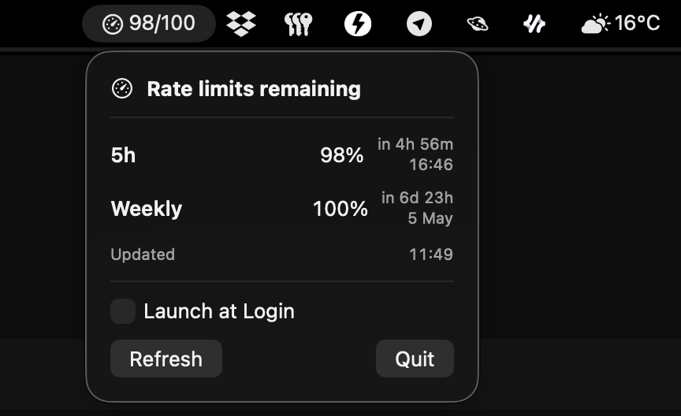

# CodexBar

CodexBar is a tiny macOS menu bar app that shows the remaining weekly Codex usage limit from your local ChatGPT Codex auth.

> Unofficial utility. Not affiliated with, endorsed by, or sponsored by OpenAI.

It reads your local Codex auth data, calls the usage endpoint, and displays the weekly remaining percentage directly in the menu bar.

Status: experimental personal-use MVP.

## Features

- Menu bar status with the weekly remaining value
- Dropdown details: reset times, last update timestamp
- Manual refresh button
- Automatic refresh every 5 minutes
- Launch at login toggle

## Requirements

- macOS 13+ or newer (uses SwiftUI `MenuBarExtra`)
- Xcode 15+ for building from source
- An existing ChatGPT Codex login with a local auth file at `~/.codex/auth.json`

## Quick Start

1. Clone this repository.
2. Open `CodexBar.xcodeproj` in Xcode.
3. Build and run the `CodexBar` target.
4. For regular local use, build a Release version and copy `CodexBar.app` to `/Applications`.

You do not need to use Xcode Archive/Distribute for local use. A regular Release build is enough.

## Authentication

CodexBar is not an OpenAI API key tool. It uses your local ChatGPT Codex session.

CodexBar reads credentials from your local Codex CLI auth file:

- Path: `~/.codex/auth.json`
- Required fields: `tokens.access_token`, `tokens.account_id`

The app does not manage login flows; if auth is missing or expired, refresh will fail until credentials are valid again.

If the access token expires, CodexBar will try one silent refresh using the local `refresh_token` before showing an error.

## Privacy & Security

- CodexBar reads auth from your local `~/.codex/auth.json` file.
- Credentials are used only to call the Codex usage endpoint and display limits in the menu bar.
- The app does not request camera, microphone, contacts, location, or photo library access.
- The current build runs without App Sandbox to allow direct local file access to `~/.codex/auth.json`.
- Never commit tokens, auth files, or local credential snapshots.
- Treat `~/.codex/auth.json` as sensitive local data.
- Do not share screenshots/logs that expose account identifiers or bearer tokens.

## Known Limitations

- The Codex usage endpoint is unofficial and may change or stop working.
- The app depends on the current Codex usage API behavior and required headers.
- The current build supports the current `rate_limit.primary_window` payload shape.
- Error feedback is intentionally compact in this MVP.

## Documentation

- Architecture overview: `docs/architecture.md`
- Common fixes: `docs/troubleshooting.md`
- Contribution guide: `CONTRIBUTING.md`
- Release notes: `CHANGELOG.md`

## Roadmap

- Make auth path resolution robust across users/environments
- Improve user-facing error states and diagnostics
- Add lightweight tests for parsing and formatting logic
- Improve menu UI details (plan info, warning states)

## License

This project is licensed under the MIT License. See `LICENSE`.
